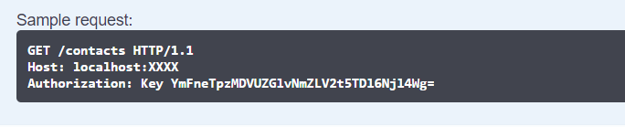

# Swagger Training

## Index
* [Aim](#Aim)
* [Disclaimer](#Disclaimer)
* [Goal](#Goal)
* [Installing Swagger](#Installing-Swagger)
* [Documenting](#Documenting)
    * [Summary](#Summary)
    * [Param](#Param)
    * [Response](#Response)
    * [Remarks](#Remarks)
    * [Others](#Others)

## Aim
This repo aims to teach and expose every useful detail of the `Swagger`/`Swashbuckle` API Documentation I could find. Contributions are appreciated.

## Disclaimer
This whole tutorial relies on using `ASP.NET Core`, specifically `.net Core 2.1`, although any `2.X` release should work.

To use as an example, I chose [BLiP's msging API](https://docs.blip.ai/?http#contacts), specifically the `ContactsExtension`, as it provides useful methods for `GET`, `POST`, `PUT` and `DELETE`, the most common `Http` verbs.

The code provided within this repo (in the **src** folder) is functional and provided **as-is**. Feel free to toy with it, but be mindful of what you choose to do with your chatbot.

---

## Goal
The end-result we are aiming for is something like the following:


## Installing Swagger
First of all, we need to get `Swashbuckle`'s packages in our **ASP.NET Core 2.1 Web API Project**. We will need two of them:


To install them via `Package Manager`:
```bash
PM> Install-Package Swashbuckle.AspNetCore -Version 4.0.1	
PM> Install-Package Swashbuckle.AspNetCore.Swagger -Version 4.0.1
```

(You can install whichever version is latest. For this, I am using the current latest stable release, `4.0.1`)

After installing it, open up your `Startup.cs` and add the following in the `ConfigureServices` method:

```csharp
services.AddSwaggerGen(c =>
{
    c.SwaggerDoc("v1", new Info { Title = "SwaggerTraining", Version = "v1" });
    var xmlFile = $"{Assembly.GetExecutingAssembly().GetName().Name}.xml";
    var xmlPath = Path.Combine(AppContext.BaseDirectory, xmlFile);
    c.IncludeXmlComments(xmlPath);
});
```

Keep in mind that the `Title` attribute within the `Info` object will be the Title of your Swagger-generated page.

After you've done that, add the following in the `Configure` method, still in the `Startup.cs` file:

```csharp
app.UseSwagger();
app.UseSwaggerUI(c =>
{
    c.RoutePrefix = "";
    c.SwaggerEndpoint("./swagger/v1/swagger.json", "SwaggerTraining V1");
});
```
The `RoutePrefix` attribute setting is *optional*. If you do not set it, your Swagger-doc will be in the `/Swagger` route. Here I set it as the root route (`/`).

Lastly, in your `.csproj` file, add the following lines:
```xml
<PropertyGroup Condition="'$(Configuration)|$(Platform)'=='Debug|AnyCPU'">
  <DocumentationFile>bin\Debug\netcoreapp2.1\SwaggerTraining.xml</DocumentationFile>
</PropertyGroup>

<PropertyGroup Condition="'$(Configuration)|$(Platform)'=='Release|AnyCPU'">
  <DocumentationFile>bin\Release\netcoreapp2.1\SwaggerTraining.xml</DocumentationFile>
</PropertyGroup>
```
where you need to replace the `netcoreapp2.1` path with your version of .NET Core and the `SwaggerTraining.xml` filename with the project's name. This will tell the compiler to generate a `.xml` documentation file every time you compile, which Swagger will in turn use.

With all that done, swagger should be installed and configured. All that is left is to properly document your controllers and actions.

---

## Documenting
To generate the `.xml` documentation, we will use the `C#` native feature: Triple slash comments (`///`).

> Tip: if using **VisualStudio**, you can quickly type `///` atop any method to quickly add a `.xml` documentation snippet.

Here is an example:
```csharp
/// <summary>
/// Gets all contacts from a bot's contact list
/// </summary>
/// <param name="authorization">The Authorization (Key) for the requested bot</param>
/// <remarks>
/// Sample request:
///     
///     GET /contacts HTTP/1.1
///     Host: localhost:XXXX
///     Authorization: Key YmFneTpzMDVUZGlvNmZLV2t5TDl6Njl4Wg=
///     
/// </remarks>
/// <response code="200">Successfully retrieved the bot's contacts</response>
/// <response code="401">Missing or incomplete <paramref name="authorization"/> header</response>
/// <response code="500">Not mapped exception. See <c>Exception</c> object thrown for details.</response>
[HttpGet]
[ProducesResponseType(typeof(List<Contact>), 200)]
public async Task<IActionResult> GetAllAsync([FromHeader(Name = "Authorization"), Required] string authorization)
{
    //...
}
```
This is a (fully?) documented `Action`. Lets explain every aspect of it:

### Summary

```csharp
/// <summary>
/// Gets all contacts from a bot's contact list
/// </summary>
```
This property documents the `Action`'s objective. This is how it looks like on Swagger:


### Param
```csharp
/// <param name="authorization">The Authorization (Key) for the requested bot</param>
```
This property documents the parameters that the `Action` uses. You should add one line like this for each param your `Action` needs. This is how it looks like on Swagger:


Note that it has a red flag indicating it is a *required* parameter. That is set by the `Required` attribute present before the parameter:

```csharp
[FromHeader(Name = "Authorization"), Required] string authorization
```

The above line of code also gives the SwaggerUI the *header* flag (by using the `FromHeader` attribute) and the **Authorization** name (by setting the `Name` field in the `FromHeader` attribute)

### Response
```csharp
/// <response code="200">Successfully retrieved the bot's contacts</response>
/// <response code="401">Missing or incomplete <paramref name="authorization"/> header</response>
/// <response code="500">Not mapped exception. See <c>Exception</c> object thrown for details.</response>
```

This property documents the possible results of your `Action`. You should add one for each possible status code return, as anything out of the `XML` comments will **not** be documented. This can also be augmented by the following attribute:

```csharp
[ProducesResponseType(typeof(List<Contact>), 200)]
```

This will add to the documentation of the Status Code `200` (`Ok`) the return type `List<Contact>`. Here's what it looks like on the generated Swagger-doc:


### Remarks
```csharp
/// <remarks>
/// Sample request:
///     
///     GET /contacts HTTP/1.1
///     Host: localhost:XXXX
///     Authorization: Key YmFneTpzMDVUZGlvNmZLV2t5TDl6Njl4Wg=
///     
/// </remarks>
```

This property documents any aditional comments you might want to add. It even has some `Markdown` features, as you can see on SwaggerUI:



### Others
Other properties that directly alter Swagger:

* The **HTTP Verb**:

Every **HTTP Verb** has its own look on SwaggerUI, here's a few of them:


* `FromBody`, `Path` and `Query` params

Whenever you add a Path, Body (`[FromBody]`) or Query(`[FromQuery]`) parameter, you can document them as you would any other parameter. Here's how they look like on Swagger:


> Note: the query parameter here is not used in the action and is here merely to illustrate the possibility.

* Other classes/models referenced

Any model class referenced as a return or a parameter (and classes referenced within them) will also show up on Swagger:


* `Enum` parameters

Any `enum` that is used as a parameter will show up as a drop down list on Swagger:


> Note: the enum parameter here is not used in the action and is here merely to illustrate the possibility. 